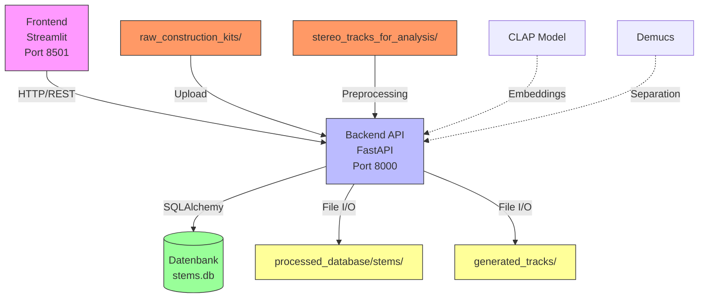

# Handbuch: Neuromorphe Traum-Engine v2.0 (Stand: 14.12.2024)

## 1. System-Architektur im Überblick

### Das Zwei-Framework-Prinzip

Die Neuromorphe Traum-Engine basiert auf einer klaren Trennung zweier Kernbereiche:

**🎛️ Intelligenter Dirigent (Live-Framework)**
- **Aufgabe**: Interaktive Steuerung und Echtzeit-Kommunikation mit dem Nutzer
- **Ort**: Frontend (Streamlit) + API (FastAPI)
- **Ziel**: Sofortige Reaktion auf Nutzeranfragen, Live-Suche, Track-Generierung

**🏭 Produktions-Fabrik (Trainings-Framework)**  
- **Aufgabe**: Rechenintensive Datenverarbeitung und Modell-Training
- **Ort**: Backend-Services + Preprocessing-Pipelines
- **Ziel**: Audio-Analyse, Embedding-Erstellung, Datenbank-Population

### System-Flussdiagramm



## 2. Datenmanagement: Wo liegen die Dateien?

### 📁 Wichtige Daten-Verzeichnisse

| Verzeichnis | Zweck | Inhalt |
|-------------|--------|---------|
| `raw_construction_kits/` | **Input für neue Audio-Dateien** | Unbearbeitete WAV/FLAC-Dateien aus Sample-Packs |
| `stereo_tracks_for_analysis/` | **Input für Track-Separation** | Vollständige Tracks zur Stem-Extraktion |
| `processed_database/stems/` | **Standardisierte Stems** | Nach Kategorien sortierte, verarbeitete WAV-Dateien |
| `processed_database/` | **Zentrale Datenbank** | `stems.db` mit allen Metadaten und Embeddings |
| `generated_tracks/` | **Finale Outputs** | Vom System gerenderte komplette Tracks als WAV |
| `models/` | **Trainierte KI-Modelle** | VAE-Modelle für generative Stem-Erstellung |

### 🔄 Der Pre-Processing-Workflow

**Lebenszyklus einer Audio-Datei - Schritt für Schritt:**

1. **Manuelles Ablegen** → Datei wird in `raw_construction_kits/` oder `stereo_tracks_for_analysis/` abgelegt
2. **Upload über Frontend** → Nutzer lädt Datei hoch und startet Verarbeitung
3. **API-Aufruf** → Backend empfängt Datei und Pfad-Information
4. **Stem-Extraktion** → Demucs trennt Track in Drums, Bass, Vocals, Other
5. **CLAP-Analyse** → Jeder Stem erhält 512-dimensionales Embedding
6. **Datenbank-Eintrag** → Metadaten + Embedding in `stems.db` gespeichert
7. **Datei-Kopie** → Standardisierter Stem wird in `processed_database/stems/{kategorie}/` kopiert

## 3. Funktionsweise: Die Services und der kreative Prozess

### 🎯 Kern-Services in einem Satz

- **PreprocessorService**: "Extrahiert und analysiert Audio-Stems aus Rohdateien"
- **SearchService**: "Findet semantisch passende Stems basierend auf natürlichsprachigen Prompts"
- **ArrangerService**: "Erstellt aus Suchergebnissen eine musikalische Partitur"
- **RendererService**: "Rendert die Partitur zu einem fertigen Audio-Track"
- **TrainingService**: "Trainiert KI-Modelle für generative Stem-Variationen"

### 🎵 Der Haupt-Workflow "Track-Generierung"

**Vom Prompt zum Track - Der komplette Prozess:**

```mermaid
graph LR
    A[Prompt<br/>"dark techno kick"] --> B[SearchService<br/>findet passende Stems]
    B --> C[ArrangerService<br/>erstellt Arrangement-Plan]
    C --> D[RendererService<br/>lädt Stems und rendert]
    D --> E[Generated Track<br/>in generated_tracks/]
```

**Detaillierte Schritte:**

1. **Prompt-Eingabe** → Nutzer gibt "driving bass with analog warmth" ein
2. **Semantische Suche** → SearchService nutzt CLAP-Embeddings für Ähnlichkeitsberechnung
3. **Arrangement-Erstellung** → ArrangerService wählt passende Stems und Reihenfolge
4. **Live-Wiedergabe** → RendererService spielt Stems in Echtzeit ab
5. **Export** → Fertiger Track wird als WAV gespeichert

## 4. Inbetriebnahme: Systemstart & typische Nutzung

### 🚀 System von Grund auf starten

**Voraussetzungen:**
- Docker & Docker Compose installiert
- 8GB+ RAM (für CLAP-Modell)
- 10GB+ freier Speicherplatz

**Schritt-für-Schritt Anleitung:**

```bash
# 1. Repository klonen
git clone <repository-url>
cd neuromorphe-traum-engine

# 2. Docker-Umgebung starten
docker-compose up --build

# 3. Warten bis alle Services gestartet sind
# (ca. 2-3 Minuten beim ersten Start)
```

**Zugriff nach erfolgreichem Start:**
- **Frontend**: http://localhost:8501
- **API-Dokumentation**: http://localhost:8000/docs  
- **Health Check**: http://localhost:8000/system/health

### 🎯 Typischer "Happy Path" für Nutzer

**Workflow in 4 einfachen Schritten:**

1. **System starten** → `docker-compose up --build` ausführen
2. **Neue Stems hinzufügen** → 
   - Frontend öffnen (http://localhost:8501)
   - Auf "Upload"-Seite gehen
   - WAV-Dateien hochladen und Verarbeitung starten
   - Warten bis "Processing complete" erscheint

3. **Stems suchen** →
   - Auf "Search"-Seite gehen
   - Text-Prompt eingeben: z.B. "deep house bass with groovy feel"
   - Ergebnisse anhören und favorisieren

4. **Track generieren** →
   - Ausgewählte Stems zur Playlist hinzufügen
   - "Generate Track" klicken
   - Fertigen Track in `generated_tracks/` finden und anhören

### 🔧 Entwickler-Schnellzugriff

**Direkte API-Aufrufe für Power-User:**

```bash
# Semantische Suche testen
curl "http://localhost:8000/api/v1/stems/search/?prompt=dark%20techno%20kick&top_k=5"

# System-Status prüfen
curl http://localhost:8000/system/health

# Alle Stems auflisten
curl http://localhost:8000/api/v1/stems/
```

---

**🎵 Fertig!** Die Neuromorphe Traum-Engine ist nun einsatzbereit und wartet darauf, dein kreatives Kollektiv-Unbewusstes zu erkunden.