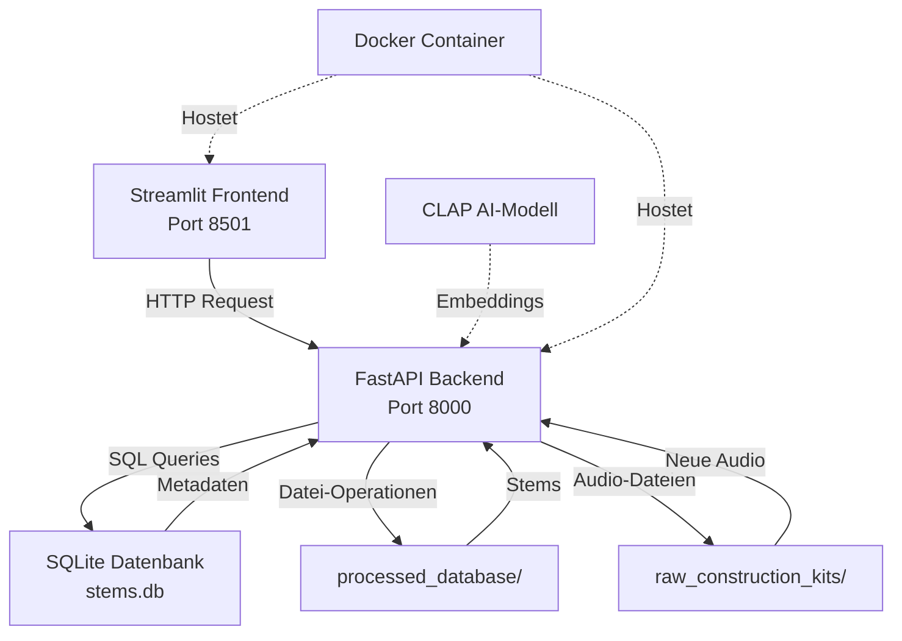
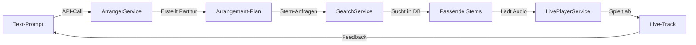

# Handbuch: Neuromorphe Traum-Engine v2.0 (Stand: 28.12.2024)

## 1. System-Architektur im Überblick

### Das Zwei-Framework-Prinzip

Die Neuromorphe Traum-Engine basiert auf einem klaren Trennungsprinzip zwischen zwei Hauptkomponenten:

**Die Produktions-Fabrik** (Backend-Logik): Diese Komponente kümmert sich um alle rechenintensiven Aufgaben. Sie verarbeitet Audio-Dateien, extrahiert KI-Embeddings, verwaltet die Datenbank und stellt die API-Endpunkte bereit. Sie läuft im Hintergrund und arbeitet wie eine hochspezialisierte Produktionsanlage, die Rohmaterial in verarbeitete Daten verwandelt.

**Der Intelligente Dirigent** (Frontend-Interaktion): Diese Komponente ist die kreative Schnittstelle für den Nutzer. Sie ermöglicht die intuitive Interaktion mit dem System durch natürliche Spracheingaben, visuelle Rückmeldungen und direkte Steuerung der Audio-Wiedergabe. Der Dirigent interpretiert die kreativen Wünsche des Nutzers und leitet sie an die Produktions-Fabrik weiter.

### System-Flussdiagramm



## 2. Datenmanagement: Wo liegen die Dateien?

### Speicherorte der Daten

| Verzeichnis | Zweck | Inhalt |
|-------------|--------|---------|
| `raw_construction_kits/` | **Eingangs-Depot** | Neue, unbearbeitete Audio-Dateien (WAV, FLAC, MP3) aus Sample-Packs oder eigenen Aufnahmen |
| `processed_database/` | **Zentrales Lager** | Die zentrale `stems.db` SQLite-Datenbank mit allen Metadaten und die standardisierten, verarbeiteten WAV-Dateien |
| `generated_tracks/` | **Ausgangs-Depot** | Die finalen, von der Engine gerenderten kompletten Tracks als WAV-Dateien (noch in Entwicklung) |
| `models/` | **KI-Modelle** | Das CLAP-Modell und ggf. weitere KI-Modelle (ca. 1.5GB) |
| `test_data/` | **Test-Umgebung** | Test-Audio-Dateien für Entwicklung und Debugging |

### Der Pre-Processing-Workflow

Der Lebenszyklus einer einzelnen Audio-Datei in 5 klaren Schritten:

1. **Manuelles Ablegen**: Neue Audio-Dateien werden in `raw_construction_kits/` abgelegt
2. **API-Aufruf**: Über das Frontend oder CLI wird die Verarbeitung angestoßen
3. **Analyse-Phase**: Der PreprocessorService analysiert die Datei und extrahiert:
   - CLAP-Embeddings (512-dimensionaler Vektor)
   - Audio-Metadaten (BPM, Lautstärke, Dauer)
   - Datei-Informationen (Pfad, Format, Größe)
4. **Datenbank-Eintrag**: Alle Metadaten werden in `stems.db` gespeichert
5. **Standardisierung**: Die Audio-Datei wird als standardisiertes WAV in `processed_database/stems/` kopiert

## 3. Funktionsweise: Die Services und der kreative Prozess

### Die Kern-Services in einem Satz

- **PreprocessorService**: Verwandelt rohe Audio-Dateien in durchsuchbare, mit Metadaten angereicherte Stems
- **ArrangerService**: Erstellt aus einem Text-Prompt eine musikalische "Partitur" - einen detaillierten Plan welche Stems wann und wie kombiniert werden sollen
- **SearchService**: Findet die semantisch passenden Audio-Stems zu einer natürlichen Sprachbeschreibung
- **LivePlayerService**: Spielt die generierte "Partitur" in Echtzeit ab und ermöglicht live das Arrangement zu modifizieren
- **NeuroAnalyzer**: Extrahiert erweiterte musikalische Features wie Harmonie, Rhythmik und energetische Eigenschaften

### Der Haupt-Workflow "Track-Generierung"

Der komplette Prozess von der Idee zum klingenden Track:



**Detaillierter Ablauf:**

1. **Prompt-Eingabe**: "Ich brauche einen treibenden Techno-Track mit dunklem Bass und hypnotischen Percussion-Loops"
2. **Arrangement-Erstellung**: Der ArrangerService erstellt eine strukturierte Partitur mit:
   - Timeline (Intro, Aufbau, Peak, Outro)
   - Stem-Kategorien (Bass, Drums, Synth, FX)
   - Energie-Kurve über die Track-Länge
3. **Stem-Suche**: Für jede Kategorie sucht der SearchService die passenden Stems:
   - "dunkler Bass" → Finde Bass-Loops mit tiefen Frequenzen
   - "hypnotische Percussion" → Finde repetitive Drum-Patterns
4. **Live-Wiedergabe**: Der LivePlayerService:
   - Lädt die gefundenen Stems
   - Startet die Wiedergabe nach der Partitur
   - Ermöglicht Echtzeit-Manipulation (Tempo, Effekte, Mix)

## 4. Inbetriebnahme: Systemstart & typische Nutzung

### Schritt-für-Schritt Systemstart

#### Variante 1: Docker (empfohlen für Anfänger)

```bash
# 1. Terminal öffnen und zum Projektordner navigieren
cd e:\VS-code-Projekte-5.2025\neuromorphe-traum-engine

# 2. System starten (erstes Mal dauert länger wegen Modell-Download)
docker-compose up --build

# 3. Services sind bereit wenn folgende Meldungen erscheinen:
# - Backend: "Application startup complete"
# - Frontend: "You can now view your Streamlit app"
```

#### Variante 2: Lokale Entwicklung

```bash
# 1. Backend starten (Terminal 1)
cd e:\VS-code-Projekte-5.2025\neuromorphe-traum-engine
python -m uvicorn src.main:app --reload --host 0.0.0.0 --port 8000

# 2. Frontend starten (Terminal 2)
python -m streamlit run frontend/app.py --server.port 8501
```

### Zugriff nach dem Start

| Service | URL | Zweck |
|---------|-----|--------|
| **Frontend** | http://localhost:8501 | Haupt-Oberfläche für Suche und Upload |
| **API-Dokumentation** | http://localhost:8000/docs | Interactive API-Dokumentation (Swagger) |
| **Health Check** | http://localhost:8000/system/health | System-Status prüfen |

### Typischer "Happy Path" für neue Nutzer

#### Phase 1: System kennenlernen (5 Minuten)
1. **System starten**: Docker-Compose Befehl ausführen
2. **Frontend öffnen**: http://localhost:8501 im Browser
3. **Health Check**: Auf der Startseite System-Status prüfen

#### Phase 2: Erste Stems hinzufügen (10 Minuten)
1. **Dateien vorbereiten**: 5-10 Techno-Samples (Drums, Bass, Synth) in `raw_construction_kits/` ablegen
2. **Upload im Frontend**: Über "Audio Upload" die Dateien auswählen
3. **Verarbeitung starten**: "Process Audio" klicken und warten (je nach Dateianzahl 2-10 Minuten)
4. **Ergebnis prüfen**: In der Datenbank-Übersicht die neuen Stems sehen

#### Phase 3: Erste Suche ausprobieren (5 Minuten)
1. **Zur Suche wechseln**: Im Frontend auf "Suche" klicken
2. **Prompt eingeben**: "deep techno kick drum" oder "melodic synth arpeggio"
3. **Ergebnisse erkunden**: Die gefundenen Stems anhören und Ähnlichkeits-Scores prüfen
4. **Feinsuche**: Mit verschiedenen Beschreibungen experimentieren

#### Phase 4: Live-Experiment (Zukunftsfeature)
1. **Track-Generator**: Bald verfügbar über "Generate Track"
2. **Prompt formulieren**: Komplette Track-Beschreibung eingeben
3. **Live hören**: Den generierten Track in Echtzeit miterleben
4. **Anpassen**: Parameter wie Länge, Energie, Komplexität verändern

### Fehlerbehebung beim Start

**Problem: Port 8000 oder 8501 bereits belegt**
```bash
# Alternative Ports verwenden
docker-compose up --build -d
# Dann in docker-compose.yml Ports ändern
```

**Problem: CLAP-Modell lädt nicht**
- Internetverbindung prüfen (1.5GB Download)
- Firewall-Einstellungen überprüfen
- Warten - erster Download kann 5-10 Minuten dauern

**Problem: Keine Audio-Wiedergabe**
- Im Frontend: Audio-Player Test-Button verwenden
- System-Lautstärke prüfen
- Browser-Berechtigungen für Audio prüfen

### Nächste Schritte nach erfolgreichem Start

1. **Eigene Sample-Sammlung integrieren**: Techno-Samples in `raw_construction_kits/` ablegen
2. **API erkunden**: http://localhost:8000/docs für direkte API-Tests
3. **Erweiterte Suche**: Komplexe Prompts mit mehreren Deskriptoren testen
4. **Monitoring**: System-Logs über `docker-compose logs -f` verfolgen

---

**Zusammenfassung**: Die Neuromorphe Traum-Engine ist nun einsatzbereit. Das System vereint KI-gestützte Audio-Analyse mit intuitiver Bedienung und ermöglicht die semantische Suche in großen Sample-Bibliotheken. Der kreative Workflow von der Idee zum fertigen Track wird durch moderne KI-Technologie unterstützt und beschleunigt.